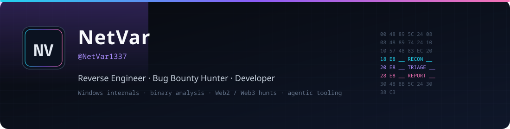

<div align="center">
  
</div>

<br/>

<div align="center">

**I reverse binaries, hunt bugs, and ship the tooling that makes both faster.**

Windows internals · IDA / Ghidra · Web2 & Web3 bounties · agentic security systems

<br/>

<a href="https://github.com/BitterSecurity"></a>
<a href="https://decepticon.red"></a>
<a href="https://x.com/NetVar1337"></a>
<a href="https://tryhackme.com/p/netvar"></a>
<a href="https://discord.com/users/netvar"></a>


</div>

---

I work where **low-level systems** and **offensive research** meet product engineering.

That means taking apart Windows kernel / hypervisor behavior, mapping how a binary actually runs, then turning the findings into reports, automations, and platforms other hunters can use. I co-build **[Decepticon](https://github.com/BitterSecurity/Decepticon)** — an autonomous red-team agent with 5.6k+ stars — and **[Vigilo](https://github.com/BitterSecurity/Vigilo)**, an AI researcher for Web3 bounties and audit contests.

> If you understand how the machine thinks, you can prove where it fails.

## Focus

<table>
<tr>
<td width="33%" valign="top">

### Reverse Engineering
Static + dynamic analysis of native code, drivers, and anti-tamper. Kernel emulation, VT-x research, protocol recovery.

`IDA Pro` `Ghidra` `x64dbg` `WinDbg` `Frida` `Unicorn`

</td>
<td width="33%" valign="top">

### Bug Bounty
Authorized Web2 / Web3 hunting: recon, root-cause, and report quality. Smart-contract review, contest work, agent-assisted triage.

`Web2 / Web3` `audit contests` `Burp` `Vigilo`

</td>
<td width="33%" valign="top">

### Development
C/C++, Rust, Go, Zig, Python, TypeScript. MCP servers, desktop HUDs, agent infrastructure, embedded Linux.

`systems` `CLI` `MCP` `FPGA` `desktop`

</td>
</tr>
</table>

## Featured work

<div align="center">
  <a href="https://github.com/BitterSecurity/Decepticon">
    
  </a>
  <a href="https://github.com/BitterSecurity/Vigilo">
    
  </a>
  <a href="https://github.com/NetVar1337/vibe-island">
    
  </a>
  <a href="https://github.com/NetVar1337/Kevlar-Ultimate">
    
  </a>
  <a href="https://github.com/NetVar1337/omniwire">
    
  </a>
  <a href="https://github.com/NetVar1337/decepticon-ghidra-mcp">
    
  </a>
</div>

| Project | What it is |
|:---|:---|
| **[Decepticon](https://github.com/BitterSecurity/Decepticon)** | Autonomous red-team agent — end-to-end authorized assessments, RoE-aware execution |
| **[Vigilo](https://github.com/BitterSecurity/Vigilo)** | AI researcher for Web3 / smart-contract bounties, audit contests, and exploit reasoning |
| **[Kevlar](https://github.com/NetVar1337/Kevlar-Ultimate)** | Windows kernel-driver emulation & behavioral analysis harness (Unicorn) |
| **[Ophion](https://github.com/NetVar1337/Ophion)** | Intel VT-x hypervisor research — EPT, VMCS, VM-exit interception |
| **[Ghidra MCP](https://github.com/NetVar1337/decepticon-ghidra-mcp)** | Full Ghidra MCP (P-code, BSim, version tracking, emulation) for agentic RE |
| **[omniwire](https://github.com/NetVar1337/omniwire)** | Agent-swarm infrastructure — MCP tools, A2A, mesh VPN, browser automation |
| **[vibe-island](https://github.com/NetVar1337/vibe-island)** | Native Dynamic Island HUD for AI coding agents (macOS, Windows, Linux) |
| **[AiDA](https://github.com/NetVar1337/AiDA-Fork)** | IDA Pro 9.x plugin — AI-assisted reverse engineering of complex C++ binaries |

## Stack

<div align="center">

**Languages**


**Analysis**


</div>

## Now

- Kernel & hypervisor research — VT-x, driver emulation, Windows internals
- Bug bounty & Web3 audit pipelines — Decepticon / Vigilo, report automation
- Agentic RE — Ghidra / IDA MCP, binary triage at swarm scale
- Systems tooling — MCP lifecycle, native HUDs, low-latency developer UX

## Activity

<div align="center">
  
  
  <br/>
  
  <br/>
  <picture>
    <source media="(prefers-color-scheme: dark)" srcset="https://raw.githubusercontent.com/NetVar1337/NetVar1337/output/github-contribution-grid-snake-dark.svg" />
    <source media="(prefers-color-scheme: light)" srcset="https://raw.githubusercontent.com/NetVar1337/NetVar1337/output/github-contribution-grid-snake.svg" />
    
  </picture>
</div>

---

<div align="center">

Open to **bug bounty collabs**, **RE / Windows internals work**, and **security-product engineering**.

[Decepticon](https://decepticon.red) · [GitHub](https://github.com/NetVar1337) · [X](https://x.com/NetVar1337) · [TryHackMe](https://tryhackme.com/p/netvar)

```c
while (true) { if (understand_the_machine()) prove_the_bug(); }
```

</div>
